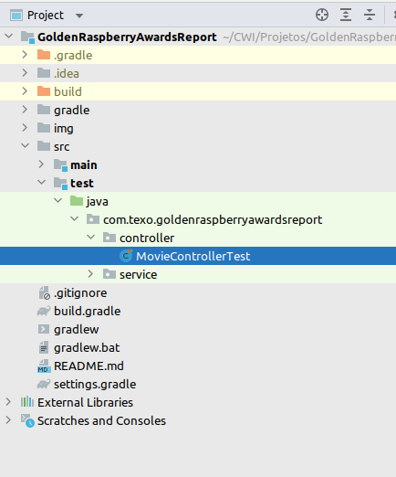
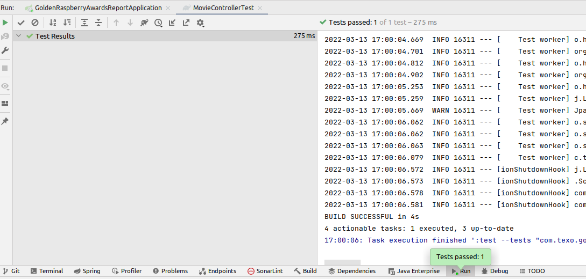

# GoldenRaspberryAwardsReport
API RESTful para possibilitar a leitura da lista de indicados e vencedores da categoria Pior Filme do Golden 
Raspberry Awards

----
### Configuração do projeto

Projeto padrão utilizando Spring Boot
- No Intellij Idea ir em File
- Open e selecionar a pasta raiz do projeto

- Após a seleção sugira um mensagem peguntado se deseja configurar e abrir o projeto

- Clique em **Trust Project**
- Aguarde até que o Intellij Idea finalize as configurações


### Alterando o arquivo .csv

- Como não era especificado o modo como deveria ser carregado as informações, apenas adicionei o arquivo
no diretório _src > main > resources > data > movielist.csv_
- Para modificar os dados de consulta apenas substituir esse arquivo por um novo de mesmo nome

----
### Rodando o projeto

- Com as configurações padrões do Intellij Idea já vai aparece a opção de inicializar o serviço

- Apenas clique no play ou pelo atalho **Shift+F10**
- Aguarde o serviço iniciar

- Para facilitar, mantive todas as configurações padrões, com isso a porta vai subir como 8080

----
### Chamando a API

- Para chamar a API e obter o resultado, apenas importar essa cURL no postman

```
curl --location --request GET 'http://localhost:8080/goldenraspberryawards/minandmaxwinners'
```

----
###Executação dos teste

- Basta caminhar sobre a árvore do projeto no seguinte diretório _src > test > controller_ clicar com 
o botão direito sobre **MovieControllerTest** e selecionar **Run 'MovieControllerTest'** e 
aguardar a execução



